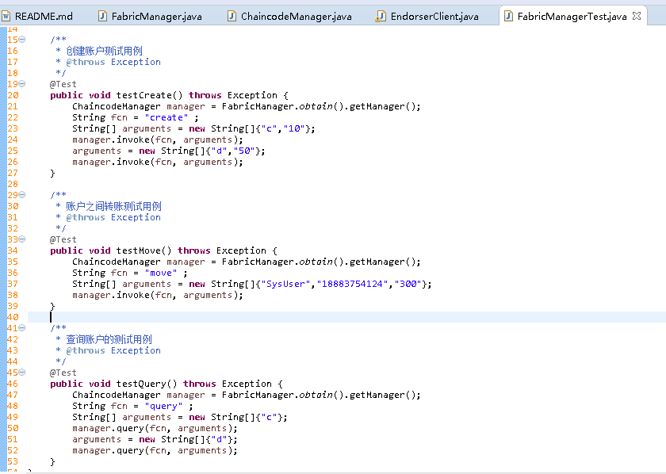

# fabric-boyacx-sdk-java
基于fabric-sdk-java release1.1.0封装搭建运用实例

* 1.启动fabric-sdk-java的网络,执行src/test/sdkintegration/fabric.sh脚本文件，即可将网络启动。脚本命令包含了：./fabric.sh up 强制重新创建网络(默认会启动)、./fabric.sh start启动
./fabric.sh stop停止、./fabric.sh clean清理生成的docker容器

* 2.替换本项目下的src/main/resource/fabric/chaincode/example_cc.go到fabric-sdk-java项目下的src/test/fixture/sdkintegration/sample1/src/github.com/example_cc/example_cc.go,在官方chaincode基础上自定义了创建账户的操作

* 3.down fabric-sdk-java源码并执行一次测试类下的End2EndIT测试方法，执行该测试方法时为了构建一个通道，并将org加入通道，然后安装链码，实例化链码，当然也可以通过已经搭建好的环境下的cli客户端工具进行初始化创世块、安装链码、实例化链码等操作

* 4.替换src/main/resource/fabric/crypto-config文件夹为官方提供的 cryptogen 工具运行生成的组织关系和身份证书

* 5.修改配置文件FabricManager.java，修改如下
``` java
...大约在34行，这里通道名称为自己搭建环境创建的通道上保持一致，官方fabric-sdk-java创建的通道为"foo"
private final static  String channelName = "foo" ;
...
大约在89行，指定调用的链码为搭建的环境上安装的链码保持一致
config.setChaincode(getChaincode(channelName, "example_cc_go", "github.com/example_cc", "1"));
...
大约在98行左右，getOrderers方法中，修改你的orderer节点服务器地址,搭建的环境上有几个order节点则添加几个
orderer.addOrderer("orderer0.example.com", "grpc://x.x.x.xx:7050");
...
大约在114行左右，getPeers方法中，修改你的peer节点服务器地址
peers.addPeer("peer0.org1.example.com", "peer0.org1.example.com", "grpc://x.x.x.xx:7051", "grpc://x.x.x.xx:7053", "http://x.x.x.xx
``` 
* 6.运行FabricManagerTest单元测试，包含了创建账户、账户转账、以及查询账户

